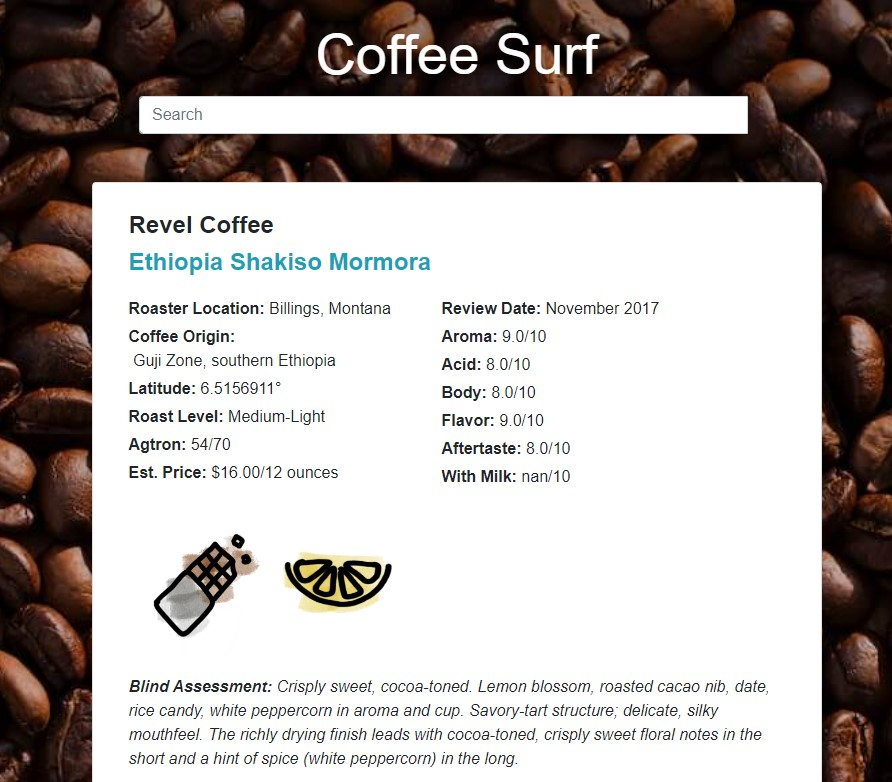

# Coffee Surf

## What it does

- We built a search engine for finding a coffee that you already like or a coffee with certain characteristics
- We can then make recommendations based on the taste profile
  
## How we built it

- We found a review database for coffees that had a poor search results and made no recommendations
- We first extracted features from the descriptions with NLTK
- We then used KNN to find the best recommendations for each coffee
- We started the front end with a template and we adapted it so that it shows the data from Flask
- We ended up implementing our own simple search engine

## Challenges we ran into

- We had a lot of trouble starting out each step since we were not familiar with many tools we needed
- We especially had trouble making a font-end that works with the processing we did before since we both never really did web development.

## Accomplishments that we're proud of

- It's our first project with NLP
- It's our first project that involves web-development
  
## What we learned

- Fullstack development is hard!
- We learned how to use NLTK for the first steps of an NLP project
- We learned how to use templates in Flask to direct to a webpage based on Python backend

## What's next for Coffee Surf

- We would first like to scrape data from more local roasters to be more useful
- Also, it would be really cool to generate a (pretentious) description from some keywords (think "almost a suggestion of vanilla"- James Hoffmann)
  